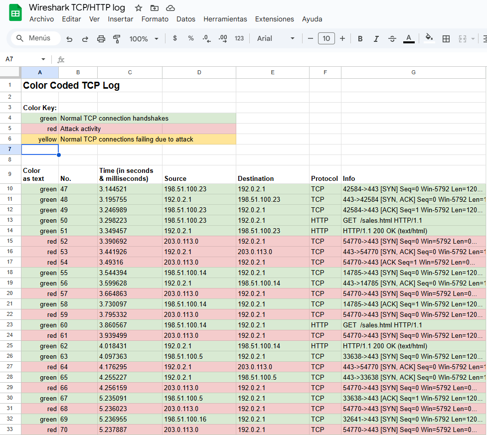
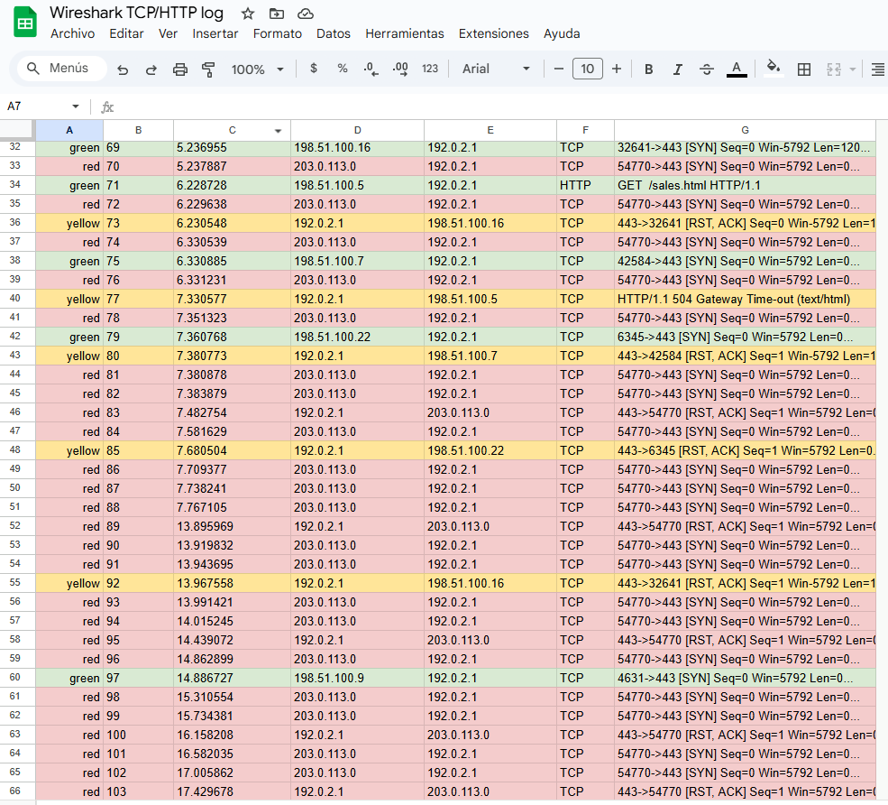

# Análisis de Incidente: Network Security (SYN Flood Attack) 🛡️🌐

## 📝 Escenario del Proyecto
Investigación técnica de un ataque de denegación de servicio (**DoS**) de tipo **SYN Flood**. El objetivo fue analizar el tráfico de red, identificar el origen del ataque y documentar el impacto utilizando marcos de trabajo estándar de la industria.

## 🛠️ Herramientas y Datos
* **Dataset:** Logs de tráfico TCP/HTTP exportados de Wireshark.
* **Metodología:** NIST CSF e investigación basada en las "5 W".
* **Análisis Visual:** Identificación de patrones de inundación SYN y agotamiento de recursos.

## 🚀 Análisis de Evidencia

### 1. Tráfico Crudo (Dataset)
El análisis se basó en el registro completo de tráfico de red:
* **[📄 Descargar Logs de Wireshark (CSV)](./Network_Traffic_Logs.csv)**

### 2. Evidencia Visual del Ataque
Durante la investigación, se identificaron dos puntos críticos:

**A. Inundación de paquetes SYN:**
Se observa un volumen masivo de solicitudes SYN desde una IP externa que no completa el handshake, diseñado para saturar las conexiones del servidor.

**B. Impacto en el Servicio (Timeout):**
Como consecuencia del ataque, las solicitudes legítimas comenzaron a fallar por agotamiento de recursos (Timeout).

## 📊 Entregables
* **[📄 Informe Final de Análisis de Incidente](./Analisis_Incidente_SYN_Flood.pdf)**

---
*Proyecto realizado como parte del Certificado de Ciberseguridad de Google.*
